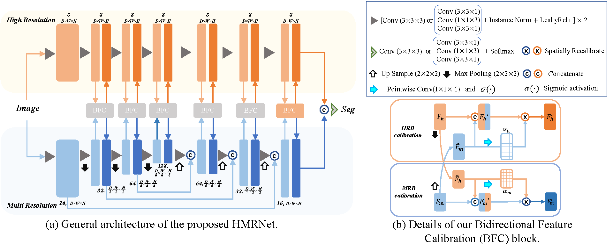

# The Second Place of MICCAI 2020 ABCs Challenge
[nnUNet_link]:https://github.com/MIC-DKFZ/nnUNetdescribe
[PyMIC_link]:https://github.com/HiLab-git/PyMIC
[ABCs_link]:https://abcs.mgh.harvard.edu/
This repository provides source code for MICCAI 2020 Anatomical brainBarriers to Cancer spread (ABCs) challenge. Method will be briefly introduced below, and our method won the 2nd place of [ABCs](ABCs_link).
Our method is based on [nnUNet][nnUNet_link], a self-adaptive segmentation method for medical images.



# Method overview
Our solution coatriaons corse and fine stage. We first use a localization model based on [nnUNet][nnUNet_link] to obtain a rough localization of five structures (Falx cerebri, Tentorium cerebelli, Sagittal & transverse brain sinuses, Cerebellum, Ventricles), and then use a High- and Multi-Resolution Network (HMRNet)  to  segment  each  structure  around  it's  local  region respectively, where a Bidirectional Feature Calibration (BFC) block  is  introduced  for  better  interaction  between  features  in the two branches. 

## Requirements
This code depends on [Pytorch](https://pytorch.org) (You need at least version 1.6), [PyMIC][PyMIC_link] and [nnUNet][nnUNet_link]. To use nnUNet, Download [nnUNet][nnUNet_link], and put them in the `ProjectDir` such as `/home/jk/project/ABCs`. 

## Usage
First, install the nnUNet and set environmental variables as follows.

```bash
cd nnUNet
pip install -e .
export nnUNet_raw_data_base="/home/jk/ABCS_data/Organ_all/nnUNet_raw_data_base"
export nnUNet_preprocessed="/home/jk/ABCS_data/Organ_all/nnUNet_preprocessed"
export RESULTS_FOLDER="/home/jk/ABCS_data/Organ_all/result"
```
Then you need replace the origin 
# Coarse stage
### Data preparation
* Creat a path_dic for dataset ,  like`[ABCs_data_dir]="/home/jk/ABCS_data" `. Then dowload the dataset from [ABCs](ABCs_link) and put the dataset in the `ABCs_data_dir`, specifically, `ABCs_data_dir/data_raw/imagesTr` for training images, `ABCs_data_dir/data_raw/labelsTr` for training ground truth and `ABCs_data_dir/data_raw/imagesTs` for test images. You can get more detailed guidance [here](https://github.com/MIC-DKFZ/nnUNet/blob/master/documentation/dataset_conversion.md).

* Run the following commands to prepare training and testing data for nnUNet. Note that the input of nnUNet has three channels.`python  ./HNRNet/data_process/creat_data_json.py`
### Training
In the coarse stage, we only need the coarse location. In order to save unnecessary time, you can change `self.max_num_epochs = 1000` to `self.max_num_epochs = 45` in nnUNet/nnunet/training/network_training/nnUNetTrainerV2.py.
* Dataset conversion and preprocess. Run:
```bash
nnUNet_plan_and_preprocess -t 001 --verify_dataset_integrity
```
* Train 3D UNet. For FOLD in [0, 1, 2, 3, 4], run:
```bash
nnUNet_train 3d_fullres nnUNetTrainerV2  Task001_ABCs FOLD --npz
```
### Inference
Run the following command:
```bash
nnUNet_predict -i INPUT_FOLDER -o OUTPUT_FOLDER -t 001 -m 3d_fullres -f 4 -chk model_best 
```

# Fine stage
First, you need to add the HMRNet into the nnUNet framework. 
* Add `HMRNet_p.py` and `HMRNet_s.py` into the `/nnUNet/nnunet/network_architecture/`.

* Replace the `nnunet/training/loss_functions/dice_loss.py` with the file `HMRNet/HMRNet/dice_loss.py`.

* Replace the `nnunet/training/network_training/nnUNetTrainerV2.py` with the file `HMRNet/HMRNet/nnUNetTrainerV2.py`.


